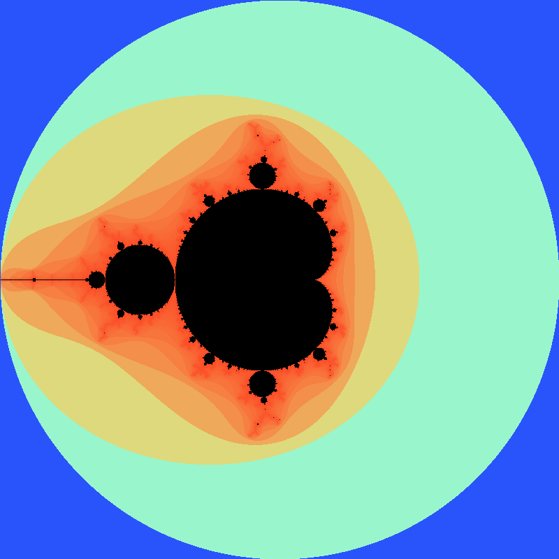
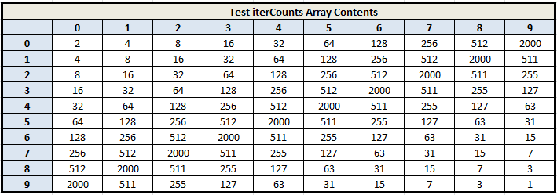
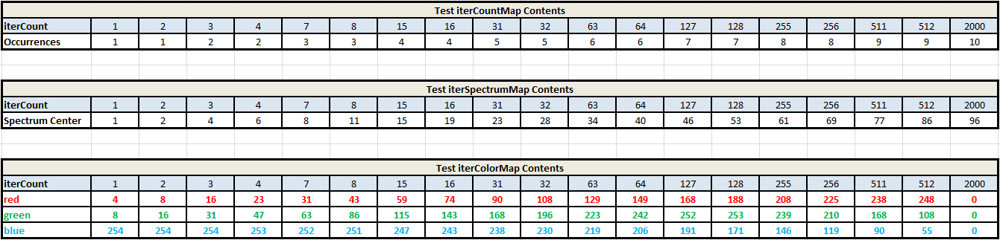

**Due**: Monday, August 6th by 11:59 PM

Getting Started
===============

Download [CS201\_Assign06.zip](CS201_Assign06.zip) and import it into your Eclipse workspace (**File&rarr;Import&rarr;General&rarr;Existing projects into workspace&rarr;Archive file**.)

You should see a project called **CS201\_Assign06** in the Package Explorer. You will be making changes to the **ColorMappingColorChooser** class. You will also be adding test cases to the **ColorMappingColorChooserTest** class.  You should add any additional classes or methods needed to complete the assignment.

Your Task
=========

Your task is to implement a color chooser for the [Mandelbrot Set](http://en.wikipedia.org/wiki/Mandelbrot_set) renderer from [CS201 Assignment 5](assign05.html).

Here are a couple of images captured from the Mandelbrot Set rendered using the color map that you will be implementing for this assigmment (click to see larger images):

> <a href="img/assign06/MantaRayAndSeahorses.png"></a>
> <a href="img/assign06/SpiralSeahorses.png"></a>

You can also try running an example interactive GUI implementing the new color chooser:

> [mandelbrot2-obfuscated.jar](mandelbrot2-obfuscated.jar)

You will be creating a class that will be called from a supplied rendering program.  You will be able to use the program to explore the Mandelbrot Set rendered with the ColorMappingColorChooser you will be implementing.  The program allows zooming in by dragging the mouse, and zooming back out by clicking the right mouse button.

You will also be adding JUnit test cases to thoroughly test the new color mapping class.  Expected values for each of the three methods you are to implement are supplied, along with JUnit test cases for you to use as examples for the additional test cases you need to provide.

If you have implemented the new color mapping class correctly, the initial rendering of the full Mandelbrot Set, from (-2,2) to (2,-2), will look like this, based on an 800 x 800 image, and maximum iteration count of 2000 (click to see a larger image):

> <a href="img/assign06/FullMandelbrotSet.png"></a>

Refer back to [CS201 Assignment 5](assign05.html) for the description and details for the Mandelbrot Set.

ColorMappingColorChooser class
--------------
The **ColorMappingColorChooser** class has been supplied.  It implements the **ColorChooser** interface, which has a single method: **getColor()**.  After you have completed the following tasks, **getColor()** will return colors based on the frequency of occurrence of each iterCount.

Your task is to finish implementing the following three methods, plus provide JUnit test cases for the **createIterSpectrumMap()** and **createIterColorMap()** methods.  Additional implementation details are provided below.


    public TreeMap<Integer, Integer> createIterCountMap(int[][] iterCounts) {
        // Run through the iterCounts array passed to the method, and create
        // a map of the distinct iterCount values, along with the number of
        // occurrences of each iterCount value.  This Map will be used to
        // create the iterSpectrumMap

        // TODO: supply implementation here...

        // now we have a mapping of each iterCount with its respective frequency
        return iterCountMap;
    }

    public HashMap<Integer, Integer> createIterSpectrumMap(int[][] iterCounts) {
        // Run through the iterCountMap, and calculate the relative location
        // of each unique iterCount within the Color Spectrum, and map that
        // location to each iterCount from the iterCountMap.  This is not the
        // Color, but rather the position in the Color Spectrum for each
        // iterCount value.  This Map will be used to create the iterColorMap.

        // TODO: supply implementation here...		

        // now we have a mapping for each iterCount to its respective
        // location in the color spectrum
        return iterSpectrumMap;
    }

    public HashMap<Integer, Color> createIterColorMap(int[][] iterCounts) {
        // Run through the iterSpectrumMap and calculate the RGB color values
        // based on each iterCount's relative spectrum location from the
        // iterSpectrum Map.  This will map the iterCounts from iterCountMap
        // to RGB color values

        // TODO: supply implementation here...	

        // now we have a mapping from each distinct iterCount to its respective
        // Color, based on its relative frequency of occurrence
        return iterColorMap;		
    }



How the ColorMappingColorChooser Class Works
=============================================

In Asssignment 5, you were tasked with creating a rendering program for the Mandelbrot Set.  Part of that assignment involved developing an algorithm for mapping **iterCount** values to RGB colors.  Since the **iterCount** values do not distribute uniformly across all possible values, the color mapping task is not as straight-forward as it initially seems.  Many of the **iterCount** values tend to bunch up into tight groups, and a linear mapping of the **iterCount** values to RGB hues is not particularly effective in producing interesting color schemes.

The **ColorMappingColorChooser** class addresses the issue of the non-uniform distribution of the **iterCount** values by mapping colors to **iterCount** values based on their frequency of occurrence, rather than strictly on their value.  The frequency of occurence of each **iterCount** value determines the width of the color spectrum that applies to that **iterCount**.  The spectrum width determines the distance between the colors assigned to the distinct **iterCount** values.

Creating an instance of **ColorMappingColorChooser** requires the creation of three separate maps:
- **iterCountMap** maps each distinct **iterCount** value to the number of times it occurs in the **iterCounts** array.  This determines the frequency of occurrence and the relative width of the spectrum band (distance between the adjacent **iterCounts**).
- **iterSpectrumMap** maps each distinct **iterCount** value to the relative location in the color spectrum.  The values in the **iterCountMap** are used to find the locations for each **iterCount** in the color spectrum.  The **iterCounts** are sorted in ascending order and the widths of the prior spectrum bands are summed together to determine the relative location of each **iterCount** in the color spectrum.  Each **iterCount** is then centered within its spectrum band.
- **iterColorMap** maps each distinct **iterCount** value to its RGB color.  The relative location in the color spectrum for each **iterCount** value is pulled from the **iterSpectrumMap** and is then used inside the trignometric **sine** and **cosine** functions to provide smooth transitions between red, green, and blue.

Creating the iterCountMap
=============================
The **createIterCountMap()** method accepts a reference to the **iterCounts** array and returns a reference to the **iterCountMap** that it creates from the **iterCounts** array contents.  The **iterCountMap** correlates each distinct **iterCount** with the number of times it occurs in the **iterCounts** array.

The method must iterates through the **iterCounts** array, and it will either encounter a new entry (and initialize the occurrence count for that entry) or update the occurrence count for an existing entry.  When iteration is complete, the method should return a reference to the newly populated map.

Creating the iterSpectrumMap
==============================
The **createIterSpectrumMap()** method accepts a reference to the **iterCounts** array and returns a reference to the **iterSpectrumMap** that it creates from the **iterCountMap** contents.  The **iterSpectrumMap** correlates each distinct **iterCount** with its location in the color spectrum.  **createIterColorMap** will then assign a distinct color to each **iterCount** based on the contents of **iterSpectrumMap**.

The method must iterate through the keys of the **iterCountMap**, in ascending order, and accumulate the location of each **iterCount** from the beginning of the color spectrum.  The occurrence count for each **iterCountMap** key determines the width of the spectrum band that the **iterCount** occupies.  The sum of the prior occurence counts (widths or spectrum bands) determines the location of the leading edge of the next **iterCount** spectrum band.  Each **iterCount** is then centered in its spectrum band:

       centered location = leading edge location + (width / 2) + 1

The above result is then stored as the value in the **iterSpectrumMap** with its respective **iterCount** key.

At the end of iteration, the width of the entire spectrum (the sum of all the values in the **iterSpectrumMap**) is stored in the class field **maxLocation**.  The method then returns a reference to the newly populated map. 

Creating the iterColorMap
===========================
The **createIterColorMap()** method accepts a reference to the **iterCounts** array and returns a reference to the **iterColorMap** that it creates from the **iterSpectrumMap** contents.  The **iterColorMap** correlates each distinct iterCount with its corresponding RGB color value.

The method must iterate through the **iterSpectrumMap** to get the spectrum location for each distinct **iterCount**  The spectrum location is then used to determine the red, green, and blue color components for that **iterCount**.  Each **iterCount** key and its respective color value are then stored in the **iterColorMap**.  The **getColor()** method then returns the color associated with each **iterCount** by looking up the color in the **iterColorMap**.

The calculations for the red, green, and blue color components for each **iterCount** use its relative spectrum location:

        relative spectrum location = spectrum location / maxLocation
		
combined with the **sine** and **cosine** trig functions to generate smooth transitions between the composite RGB spectrum colors.  The color component calculations are:

```
red = sin(spectrum location / maxLocation * PI/2) * 255

green = sin(spectrum location / maxLocation * PI) * 255

blue = cos(spectrum location / maxLocation * PI/2) * 255
```

The color value is then created from:

        color = new Color(red, green, blue)
		
and is assigned to the **iterColorMap** with its respective **iterCount** key.  

The RGB color generation graph for the above scheme is shown below:

> <a href="img/assign06/TrigColorGeneration.png"></a>

Trying it out
=============

Once your **ColorMappingColorChooser** class is tested and working, you can try running it in an interactive GUI by right-clicking the **Main** class and choosing **Run as** &rarr; **Java application**.

JUnit Test Cases
===========
Under the **junit** folder included with the project is the skeleton for creating the JUnit test cases for this assignment.  The test set-up has been provided for you, including a complete set of expected results for the three Maps that you will be creating.  The test iterCounts array contents are shown below, along with the expected contents for the three Maps.  The spreadsheet used to generate the test data tables can be found [here](Assign06-JUnitTestsExpectedResults.xlsx), and you can download it and inspect the cell formulas that were used to generate the expected restuls.

The **set-up** and test cases for the **ColorMappingColorChooser** constructor and the **createIterCountMap()** method have also been provided to serve as examples for creating the test cases for the remaining two methods: **createIterSpectrumMap()** and **createIterColorMap()**.

Testing createIterSpectrumMap()
--------------------------------
In order to completely test the **createIterSpectrumMap()** method, you will need to verify that the **iterSpectrumMap** contents (keys and values) exactly match the expected values contained in **testIterSpectrumMap**:
- **iterSpectrumMap** has the expected number of keys
- **iterSpectrumMap** has the identical set of expected **iterCount** keys
- **iterSpectrumMap** has the identical set of expected spectrum locations mapped to those keys

Testing createIterColorMap()
--------------------------------
In order to completely test the **createIterColorMap()** method, you will need to verify that the **iterColorMap** contents (keys and values) exactly match the expected values contained in **testIterColorMap**:
- **iterColorMap** has the expected number of keys
- **iterColorMap** has the identical set of expected **iterCount** keys
- **iterColorMap** has the identical set of expected Colors mapped to those keys

Test iterCounts Array Contents (expected results)
--------------------------------------------------
> <a href="img/assign06/TestIterContsArrayContents.png"></a>

Test Map Contents (expected results)
-------------------------------------
> <a href="img/assign06/TestMapContents.png"></a>


Grading Criteria
================
Your submission will be graded according to the following criteria:

- createIterCountMap:             20%
- createIterSpectrumMap:          20%
- createIterColorMap:             20%
- createIterSpectrumMapTest:      15%
- createIterColorMapTest:         15%
- Design, coding style, comments: 10%

Extra Credit
-------------------
For up to 25 points of extra credit, also implement the **ExtraColorMappingColorChooser** class, which maps the **iterCounts** uniformly across the color spectrum.  In other words, rather than distributing them based on their relative size, with larger **iterCount** entries being allocated a wider region of the color spectrum, allocate the same portion of the spectrum to each existing **iterCount** in the **iterCountMap**.  Example: if there were 10 distinct **iterCounts** across 60 points to be rendered, then the **iterCounts** would be spaced 6 positions apart, centered at 3, 9, 15, etc...

To get the full extra credit, you will also have to implement a full set of JUnit test cases for each new method that you create.

<b>Important</b>: Make sure that you have the original assignment fully working before taking on the extra credit portion.  The extra credit mapping creates a separate color mapping selection when the rendering program first starts.

Submitting
==========

Save the project (**CS201\_Assign06**) to a zip file by right-clicking it and choosing

> **Export...&rarr;Archive File**

Upload the saved zip file to the Marmoset server as **assign06**. The server URL is

> <https://cs.ycp.edu/marmoset/>
